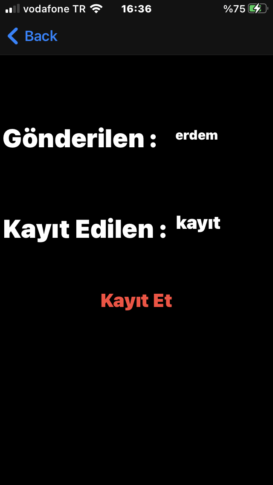

# deneme1

bu proje de constraintler ile sayfa düzenlenmiştir 

timer başlat butonu ile timer başlar

gönder butonu ile gönder textfield ın içindeki içerik diğer sayfaya segue ile gönderilir

diğer sayfaya geç butonu ile hiçbir şey gönderilmeden segue ile diğer sayfaya geçilir 

diğer sayfa da gönderilen ve kayıt edilen adında iki bölüm bulunur gönderilen kısmında 

eğer bir şey göndersiyseniz o gönderilen kısmında yazacaktır eğer hiçbir şey göndermediyseniz

yazmayacaktır eğer gönderdiğiniz karakteri userdefaulst ile kayıt etmek isterseniz kayıt et butonuna 

basmalısınız kayıt et ile karakter userdefaults ile kayıt edilecek ve önceki sayfaya geri gidip tekrar

bu sayfaya gelseniz bile o kayıt eedilen bölümünde kalacak 

# Uygulama Resimleri

# -1-

# -2-

# -3-

# -4-

# -5-

# -6- 

# -7-

# -8- 

